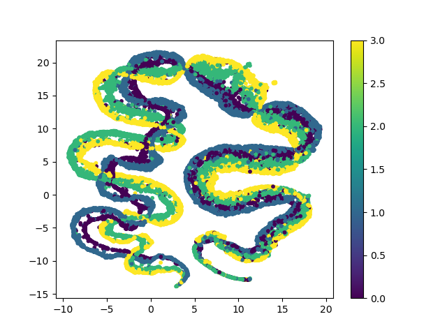

# GCN-Project
This project seeks to create a suitable multi-layer GCN model to carry out a semi supervised multi-class node classification using the [Facebook Large Page-Page Network dataset](https://snap.stanford.edu/data/facebook-large-page-page-network.html). To perform this a [Partially processed dataset](https://graphmining.ai/datasets/ptg/facebook.npz) was used where the features are in the form of 128 dim vectors.

## Data and Preprocessing
After the data is loaded in from the [Partially processed dataset](https://graphmining.ai/datasets/ptg/facebook.npz), the [Deep Graph Library](https://docs.dgl.ai/) is used to create a graph containing the edges, features and target information to be used in training the model. This library was used as it provided the most convenient way of storing and accessing the variables for use by pytorch. The dataset also determines which values will be used for training and which for testing via creating two numpy arrays of boolean values whose position corresponds to which values are for testing and which are for training. 

A test/training split of 0.8/0.2 was chosen as it allows the model to have an adequete amount of training and testing data. Considering the size of the datasets, there aren't any concerns over there being an insufficient amount of testing data or training data with this split.

## Training
This model uses a Graph Convolution Network (GCN). GCN's are good for interpreting graph-structured data, and interprets the dataset as a series of nodes (entities) and edges (relationships) between nodes. Nodes can be associated with features (acts as descriptors), which in our problem is represented by a 128 dim vector.

The graph convolution layer aggregates information from the nodes neighbours and updates the node's feature representation. The graph's convolution operation is based on a weighted aggregation of the features of neighbouring nodes. The final layer is a linear classifier that maps the output of the last GCN layer to class scores.

When it comes to reproduction of these results, while the nature of the model means extreme cases can occur rarely, the complexity of the model and a seeded random number generator means these events are unlikely, and results should be similar to the above picture with little variance.

## Predicting
a [UMAP](https://umap-learn.readthedocs.io/en/latest/plotting.html) embeddings plot with ground truth in colours was used to create a 2d representation of the model. UMAP is used to convert a high-dimensional dataset to a low-dimensional graph while still retaining most of the original information. UMAP works by calculating the distances between each pair of datapoints in the dataset. Using these calculations, UMAP then places the datapoints on the graph relative to these distances. It then uses the placements on this graph to calculate simmilarity scores depending on how many neighbours you want each point to have (In our case, 15). It then repeats this for every datapoint until you have a final graph. This helps to maintain information about clustering of relationships between datapoints.

From this model, we can see that the data tends to cluster closely together. Especially the lower (such as the blue and purple datapoints) and higher values (such as the green and yellow datapoints) tend to cluser together with very minimal variance. There are a few outliers in this graph (especially for higher values such as the green and yellow datapoints), but overall is fairly consistent. There also seems to be a sort of "snaking" effect happening on the graph, suggesting that there might be a sequential nature to the dataset (although it might also be due to the high amounts of overlapping).

## Files used
dataset.py: data loader for loading and preprocessing the data
modules.py: Source code of the component for the model
train.py: Source code for training, validating, testing and saving the model
predict.py: shows example use of the trained model, prints out any results

# Dependencies
numpy == 1.23.5
dgl == 1.1.2
torch == 2.0.1
umap-learn == 0.5.4
matplotlib == 3.7.3